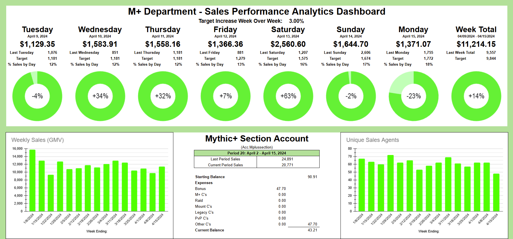
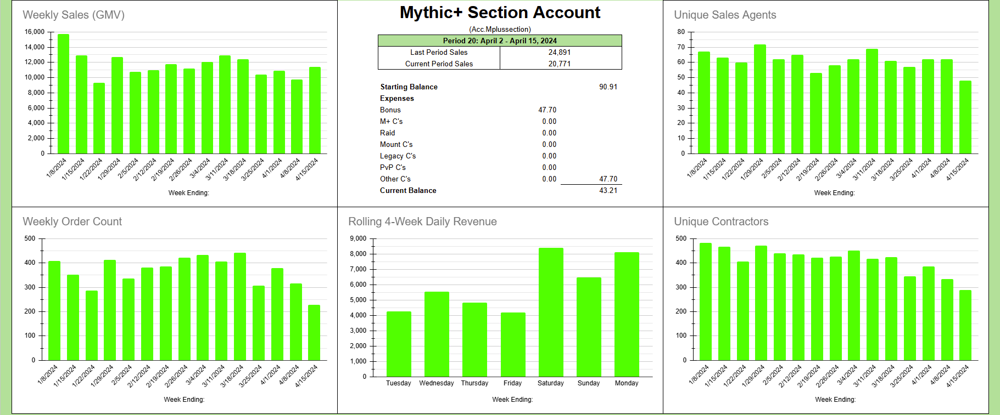
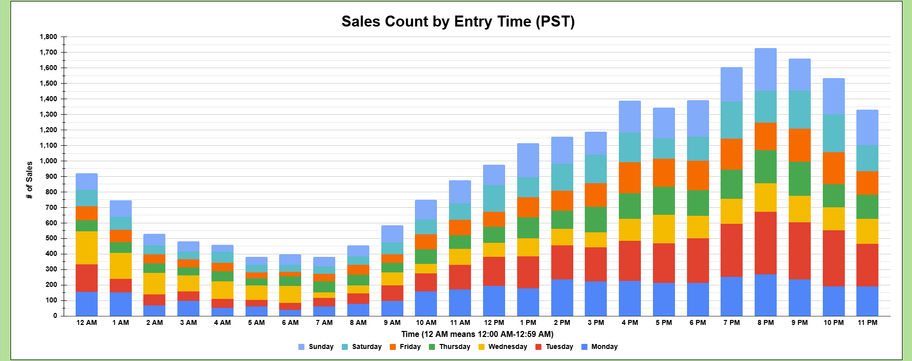

# Sales Performance Analytics Dashboard

# Summary
Developed a strategic KPI dashboard to track sales trends and buyer behavior for an organization with $1.5M in annual GMV. This tool transformed raw transaction logs into actionable insights for leadership.

  
  
  
## _**Click image to view full slide deck (7 Slides)**_

# Key Highlights
**Problem:**  
Manually calculating metrics was too slow and leadership needed a quick, automated dashboard to display critical KPIs instantly.

**The Solution:**  
I built a dashboard that automatically turns daily sales records into simple, clear charts showing monthly growth, daily sales totals, and how fast revenue is coming in.

**The Result:**  
Provided "live" data oversight for a high-volume, $1.5M operation, ensuring management never had to wait for a weekly update to see current performance.
